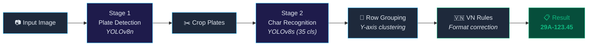

<div align="center">

# 🚗 Vietnamese ALPR System

### Automatic License Plate Recognition for Vietnamese Vehicles

[](https://python.org)
[](https://ultralytics.com)
[](https://opencv.org)
[](LICENSE)

A two-stage deep learning pipeline for detecting and recognizing Vietnamese license plates from vehicle images. Built with **YOLOv8** for both plate localization and character recognition, enhanced with **rule-based post-processing** that corrects OCR errors using Vietnamese plate format knowledge.

[Architecture](#architecture) • [Installation](#installation) • [Quick Start](#quick-start) • [GUI App](#gui-application) • [Documentation](#documentation)

</div>

---

## Demo


## ✨ Highlights

- 🎯 **Two-stage detection pipeline**: Plate detection → Character recognition
- 🇻🇳 **Vietnamese-specific**: Rule-based post-processing corrects OCR errors using VN plate format rules
- 🖥️ **Standalone desktop GUI**: Modern dark-themed Tkinter application (no web server needed)
- ⚡ Optimized inference pipeline with GPU acceleration support
- 📊 **Multiple output modes**: CLI with text/JSON/CSV output, batch processing support
- 🧪 **Well-tested**: Unit tests for post-processing logic

## Architecture



### Pipeline Details

| Stage | Model | Input | Output | Latency |
|-------|-------|-------|--------|---------|
| **Plate Detection** | YOLOv8n | Full image | Plate bounding boxes | ~10-30ms |
| **Character Recognition** | YOLOv8s | Plate crop | Character labels + positions | ~15-40ms |
| **Post-processing** | Rule-based | Raw OCR text | Corrected plate string | <1ms |

> 📖 For detailed architecture documentation, see [docs/architecture.md](docs/architecture.md)

## Vietnamese Plate Format

The system handles standard Vietnamese civilian plates:

```
Format: [Province Code][Series][Registration Number]
         2 digits     1-2 letters    5 digits

Examples:  29A-123.45    (Hà Nội, car)
           51F-038.92    (TP.HCM, motorcycle)
           30E1-567.89   (Hà Nội, extended series)
```

**OCR Error Correction**: The post-processor fixes common confusion pairs (O↔0, B↔8, S↔5, etc.) based on positional rules.

> 📖 For full format documentation, see [docs/vietnamese_plate_rules.md](docs/vietnamese_plate_rules.md)

## Installation

### Prerequisites

- Python 3.8+
- CUDA-capable GPU (recommended) or CPU

### Setup

```bash
# 1. Clone the repository
git clone https://github.com/yourusername/vietnamese-alpr.git
cd vietnamese-alpr

# 2. Create virtual environment (recommended)
python -m venv venv
source venv/bin/activate  # Linux/Mac
# or: venv\Scripts\activate  # Windows

# 3. Install dependencies
pip install -r requirements.txt

# 4. Download model weights
# Place the following files in the models/ directory:
#   - final_best.pt (plate detection model)
#   - final_char_yolo.pt (character recognition model)
# See models/README.md for download links
```

## Quick Start

### CLI — Single Image

```bash
python app_cli.py --image path/to/car_photo.jpg
```

**Output:**
```
============================================================
  Image: car_photo.jpg
============================================================

  Plate #1:
    Bounding Box : [234, 456, 567, 520]
    Confidence   : 0.923
    Raw OCR      : 29A-12345
    Corrected    : 29A-123.45
    Latency      : plate=15.2ms, char=23.8ms
```

### CLI — Batch Processing

```bash
# Process all images in a directory, output as JSON
python app_cli.py --dir ./test_images/ --format json --output results.json

# Save annotated images with bounding boxes
python app_cli.py --dir ./test_images/ --save-annotated ./output/

# Custom confidence thresholds
python app_cli.py --image car.jpg --plate-conf 0.5 --char-conf 0.4
```

### CLI — Output Formats

```bash
python app_cli.py --image car.jpg --format text    # Human-readable (default)
python app_cli.py --image car.jpg --format json    # JSON output
python app_cli.py --image car.jpg --format csv     # CSV output
```

## GUI Application

Launch the standalone desktop GUI (no web server required):

```bash
python app_gui.py
```

### Features:
- 🌙 Modern dark theme
- 📂 Browse or load sample images
- 🎚️ Adjustable confidence thresholds
- 📊 Real-time detection results with plate crops
- ⚡ Latency metrics display
- 🔄 Async model loading (non-blocking UI)

## Project Structure

```
vietnamese-alpr/
├── app_cli.py                 # CLI application
├── app_gui.py                 # Desktop GUI application (Tkinter)
├── requirements.txt           # Python dependencies
├── LICENSE                    # MIT License
│
├── src/                       # Core source code
│   ├── __init__.py
│   ├── pipeline.py            # Main ALPR pipeline
│   ├── postprocessor.py       # Vietnamese plate post-processing
│   └── utils.py               # Utility functions
│
├── models/                    # Model weights (not in Git)
│   └── README.md              # Download instructions
│
├── configs/                   # Configuration files
│   └── default.yaml
│
├── data/                      # Dataset (not in Git)
│   └── char_data.yaml         # Character class definitions
│
├── docs/                      # Documentation
│   ├── architecture.md        # System architecture
│   └── vietnamese_plate_rules.md
│
├── tests/                     # Unit tests
│   └── test_postprocessor.py
│
└── evaluation/                # Evaluation scripts
    └── evaluate.py
```

## Model Training

### Plate Detection Model

The plate detector was trained using YOLOv8n on Vietnamese vehicle images:

```bash
yolo detect train model=yolov8n.pt data=plate_data.yaml epochs=100 imgsz=640
```

### Character Recognition Model

The character recognizer was trained using YOLOv8s on cropped plate images with 35 character classes:

```bash
yolo detect train model=yolov8s.pt data=char_data.yaml epochs=150 imgsz=640
```

**Character Classes (35):**
```
Digits:  0 1 2 3 4 5 6 7 8 9
Letters: A B C D E F G H I J K L M N P Q R S T U V W X Y Z
```

## Evaluation Results

The project was evaluated on a small internal test set.

| Metric | Value |
|----------|----------|
| Plate Detection | High |
| Character Recognition | Limited |
| End-to-End Recognition | Experimental |

> Note: This project focuses on demonstrating an end-to-end ALPR pipeline architecture rather than achieving production-grade OCR accuracy.

Run the evaluation script on the test dataset:

```bash
python evaluation/evaluate.py --test-dir data/test/images/ --output eval_results.json
```

## Testing

```bash
# Run all tests
python -m pytest tests/ -v

# Run specific test file
python -m pytest tests/test_postprocessor.py -v
```

## Tech Stack

| Component | Technology |
|-----------|------------|
| Object Detection | [Ultralytics YOLOv8](https://github.com/ultralytics/ultralytics) |
| Computer Vision | [OpenCV](https://opencv.org/) |
| Desktop GUI | [Tkinter](https://docs.python.org/3/library/tkinter.html) |
| Deep Learning Backend | [PyTorch](https://pytorch.org/) |
| Image Processing | [Pillow](https://pillow.readthedocs.io/) |

## ⚠️ Known Limitations

> **This is a research/learning project** — a proof-of-concept demonstrating a complete end-to-end AI pipeline, not a production-ready system.

### Character Recognition Accuracy

The current character recognition model (Stage 2) has **low accuracy** on real-world images. Common failure cases:

| Input Plate | Raw OCR | Corrected | Status |
|-------------|---------|-----------|--------|
| `30E-636.30` | `CM5QCQCM` | `CMSQ-CQCM` | ❌ Wrong |
| `85B1-178.51` | `05RP55P00` | `05RP-55P.00` | ❌ Wrong |

**Root causes:**
- **Small training dataset** — insufficient diversity in plate styles, lighting, and angles
- **No data augmentation** — model lacks robustness to blur, rotation, occlusion, and varying contrast
- **Single-domain training** — trained primarily on clean, well-lit images; fails on noisy real-world photos
- **Character-level detection approach** — individual character detection is more fragile than sequence-based OCR (e.g., CRNN + CTC)

### What This Project Demonstrates

Despite accuracy limitations, this project showcases a **complete AI engineering pipeline**:

```
✅ Data preparation (YOLO format, 35-class labeling)
✅ Model training (YOLOv8 fine-tuning for 2 different tasks)
✅ Multi-stage inference pipeline (detect → crop → recognize → post-process)
✅ Domain-specific post-processing (Vietnamese plate format rules)
✅ Desktop GUI application (Tkinter, no web dependency)
✅ CLI with batch processing & multiple output formats
✅ Modular code architecture with unit tests
✅ Documentation & project structure ready for collaboration
```

## 🔮 Future Improvements

If continuing this project, the following changes would significantly improve accuracy:

| Improvement | Expected Impact | Difficulty |
|-------------|----------------|------------|
| **Larger, diverse dataset** (10k+ plates) | High | Medium |
| **Heavy data augmentation** (blur, rotation, noise, brightness) | High | Low |
| **Replace Stage 2 with CRNN + CTC** | Very High | High |
| **Add image preprocessing** (contrast enhancement, deskewing) | Medium | Low |
| **Ensemble multiple models** | Medium | Medium |
| **Use attention-based OCR** (TrOCR, PaddleOCR) | Very High | Medium |
| **Transfer learning** from pre-trained OCR models | High | Medium |

## Contributing

Contributions are welcome! Please feel free to submit a Pull Request.

1. Fork the repository
2. Create your feature branch (`git checkout -b feature/amazing-feature`)
3. Commit your changes (`git commit -m 'Add amazing feature'`)
4. Push to the branch (`git push origin feature/amazing-feature`)
5. Open a Pull Request

## Lessons Learned

During development, several practical challenges were identified:

- Character recognition is significantly harder than plate detection.
- Real-world images contain blur, low resolution, lighting variation, and occlusion.
- Rule-based correction can improve OCR output but cannot compensate for poor character predictions.
- Dataset quality often has a greater impact than model complexity.
- End-to-end system performance depends on the weakest stage of the pipeline.

These findings motivated future exploration of OCR architectures such as CRNN, PaddleOCR, and Transformer-based approaches.

## Dataset

The models were trained on a custom Vietnamese license plate dataset consisting of:

- Vehicle images
- Plate bounding box annotations
- Character-level annotations

Due to dataset licensing and storage constraints, training data is not included in this repository.

## Acknowledgments

- [Ultralytics](https://ultralytics.com/) for the YOLOv8 framework
- Vietnamese license plate datasets from the research community
- Inspired by real-world ALPR applications for traffic management

---

<div align="center">
  <sub>Built as a Computer Vision and AI Engineering learning project.</sub>
</div>
