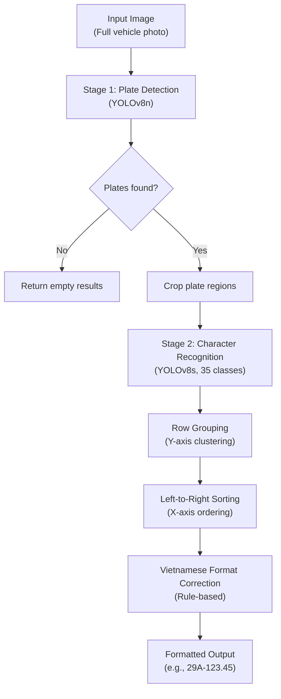
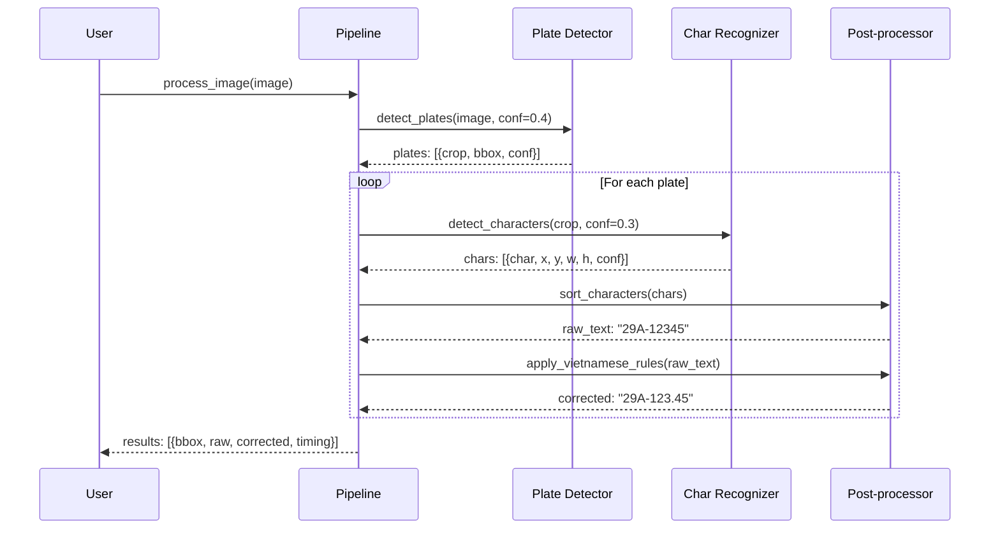

# System Architecture

## Pipeline Overview

The Vietnamese ALPR system uses a **two-stage detection pipeline** followed by **rule-based post-processing**:

```
Input Image → [Stage 1: Plate Detection] → [Stage 2: Character Recognition] → [Post-processing] → Output
```

## Detailed Architecture



## Stage 1: Plate Detection

**Model**: YOLOv8n (nano variant — optimized for speed)

- **Input**: Full vehicle image (any resolution)
- **Output**: Bounding boxes of detected license plates
- **Classes**: 1 (license_plate)
- **Inference**: ~10-30ms per image on GPU

The detector locates rectangular plate regions in the image and returns their coordinates with confidence scores. Each detected region is then cropped for the next stage.

## Stage 2: Character Recognition

**Model**: YOLOv8s (small variant — balanced speed/accuracy)

- **Input**: Cropped license plate image
- **Output**: Bounding boxes and class labels for each character
- **Classes**: 35 (digits 0-9 + letters A-Z, excluding 'O')
- **Inference**: ~15-40ms per plate crop on GPU

Each character is detected with its position (center coordinates, width, height) and predicted class. The position information is critical for the sorting stage.

## Post-processing Pipeline

### Step 1: Row Grouping (Y-axis clustering)

Vietnamese plates can be:
- **Single-row** (cars): `29A12345`
- **Two-row** (motorcycles): Line 1: `29A`, Line 2: `12345`

Characters are grouped into rows by comparing their Y-center coordinates. If the Y-distance between two characters exceeds 25% of the plate height, they are placed in separate rows.

### Step 2: Left-to-Right Sorting (X-axis)

Within each row, characters are sorted by their X-center coordinate to produce the correct reading order.

### Step 3: Vietnamese Format Correction

OCR models can confuse visually similar characters (e.g., 'O' ↔ '0', 'B' ↔ '8'). The correction module enforces Vietnamese civilian plate structure:

| Position | Type | Example |
|----------|------|---------|
| 0-1 | Digits (province code) | `29` |
| 2 | Letter (series) | `A` |
| 3 | Letter or digit | `1` or `A` |
| 4+ | Digits (registration) | `12345` |

## Data Flow Diagram



## Performance Characteristics

| Component | Typical Latency | Hardware |
|-----------|----------------|----------|
| Plate Detection | 10-30 ms | GPU (CUDA) |
| Character Recognition | 15-40 ms | GPU (CUDA) |
| Post-processing | < 1 ms | CPU |
| **Total Pipeline** | **~30-70 ms** | GPU |

> CPU-only inference is approximately 5-10x slower.
